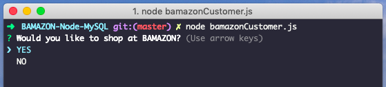
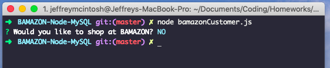
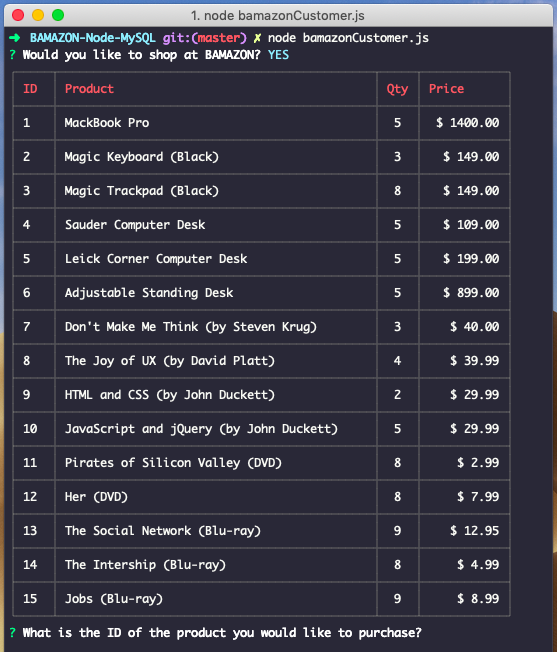
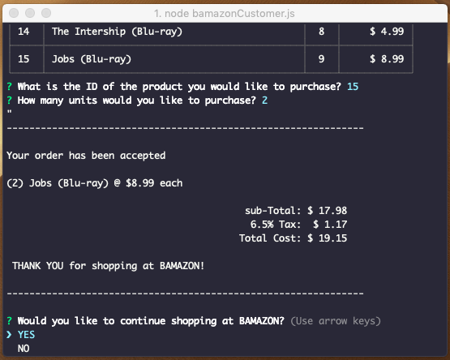
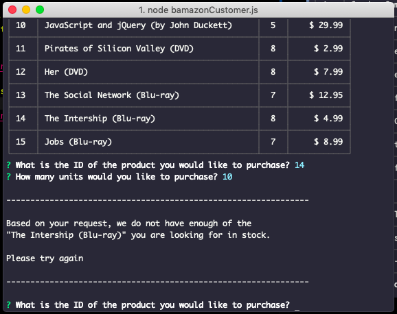
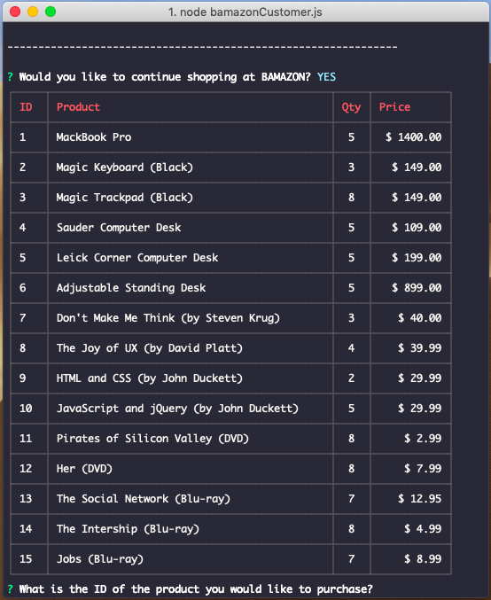
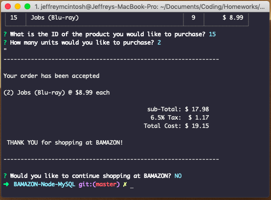

# BAMAZON-Node-MySQL

### Overview
BAMAZON is a Amazon-like storefront app that displays the available products.  The user will be asked if they would like to shop, what they would like to purchase and the quantity.  If there is enough stock for the item, they will receive a "successful" result with the total due.  If there is not enough stock for the item, they'll reeceive a "error" message and be asked to try again.   Once a purchase is successful, the user will have the option to continue shopping or "quit" which will exit from the application.

## BAMAZON Commands

**node bamazonCustomer.js** is used to run the application in the Terminal

**Initial Prompt if user would like to shop or not:**

**If "NO" is selected, the application will automatically exit**

**If "YES" is selected, the application will show the available products to the User and questions will be prompted regarding what they would like to purchase and the quantity**

**Once the User has inputted their request AND there is enough inventory to complete the order, they will be given a "recap" of what was purchased and their total due.  They will then be prompted to continue shopping or not.**

**If the User tries to order too many of a specific item, they will receive a "error" message alerting them there are not enough of the specific product they are looking for in inventory and to please try again.**

**Once order has been processes, if the User selects "YES" to continue shopping, the product list will be re-displayed with the updated quantity from previous purchase and prompted as to what they would like to purchase**

**If the User selects "NO" to continue shopping, the application will automatically exit.**

